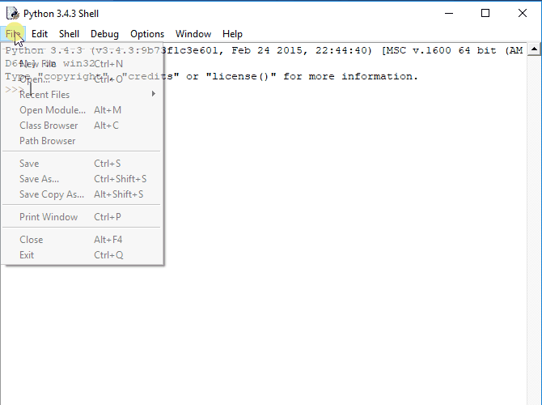

# Rummy-O-Calculator
Tells you the best hand to play in the game Rummy-O.

For this program you have to input into the computer every tile that is on the board and in your hand. With this information the computer can figure out every single possible set that can be made with those tiles. From that it will recommend to you the action which will play the most tiles from your deck and how you should arrange them into sets with the tiles on the board. Limitations of this calculator are at the bottom. 

## Getting started
Open up the main.py file in any python 3 interpreter (e.g. idle). Run the file. 
There should be no output. Just a blank line for you to type in commands. 

The test.py file was just used during development to make sure that the code worked. You can ignore it. 

## Main commands
### game.add_to_board(colour, number)
This is so that the program knows what tiles are currently on the board and should be used whenever one of your opponents adds a tile to the board. The order of tiles and who places them down does not matter. 

Example:
game.add_to_board("red", 2)

Will add a Red tile with the number 2 on it. If your opponent added a red 2 to the board this will let the computer know. Remember to use the quotation marks("") around the colour word. This is only capable of one tile at a time.

### game.draw(colour, number)
This is to be used when you pick up a tile from the table/deck and add it to your hand. 

Example:
game.draw("blue", 2)

Will add a blue tile with the number 2 to your hand. This will let the computer know what tile you drew and added to your hand on your turn. Remember to use the quotation marks("") around the colour word. This is only capable of one tile at a time. 

### game.play(colour, number)
This is to be used when you decide to play a tile from your hand onto the board. The computer will remove it from your hand and add it to the board. 

Example:
game.play("orange", 7)

If you don't have that tile currently in your hand then the computer will tell you to try again.  Remember to use the quotation marks("") around the colour word. This is only capable of one tile at a time.  

### game.view_hand()
This will show you what the computer thinks is currently in your hand.

Example:
game.view_hand()

Tiles will be displayed in brackets like this ("red", 4). Which represents a red tile of the value 4. 

### game.view_board()
This will show you what the computer thinks is currently on the board.

Example:
game.view_board()

Tiles will be displayed in brackets like this ("red", 4). Which represents a red tile of the value 4. 

### game.best_move()
What the best move for you to play is given the tiles on the board and the tiles in your hand. This move should be used at the start of your turn to inform you of what tiles you should play.

Example: 
game.best_move()

This will tell you the tiles from your deck that you should use and all the sets that should be on the table if those cards are played. Remember that when you actually play those cards you will need to use game.play(colour, number) 

## Extra commands
### game.remove_from_board(colour, number)
If you have made a mistake this will allow you to remove a tile from the board

### game.remove_from_hand(colour, number)
If you have made a mistake this will allow you to remove a tile from your hand

## Calculator Limitations 
At the moment it is unable to handle jokers. Therefore if there is a joker in your hand, You will just have to pretend it is not there. And if it is on the table you will have to input it as what it is on the table. If you want this program to work its best, just come up with an excuse to not play with the joker tiles e.g. hide them and remove them from the game before the other players notice. 

The calculator is also not able to plan ahead. If you are planning on not playing a set because you think a better opportunity will arise later the calculator will not be able to think in the same way. If the calculator says that you should play your best tiles now but you want it to make a solution that exclude your best tiles you will have to use game.remove_from_hand(colour, number) so that it doesn't know that you have those tiles. 
